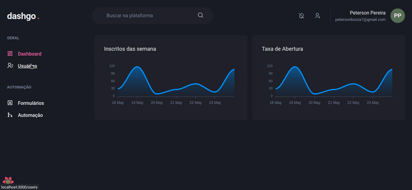

# DashGo

<p align="center">Esse projeto é Dashboard construido unicamente com ChakraUI usando interface declarativa..</p>

<p align="center">
 <a href="#features">Features</a> •
 <a href="#pré-requisitos">Pré Requisitos</a> • 
 <a href="#rodando-o-front-end">Rodando a aplicação</a> • 
 <a href="#tecnologias">Tecnologias</a> •
 <a href="#autor">Autor</a> •

</p>

---

<br>

<h1 align="center">
  
</h1>

### Features

- [x] Formulario usando React Hook Form
- [x] Validação usando yup
- [x] Interface declarativa usando ChakraUI

### Pré-requisitos

Antes de começar, você vai precisar ter instalado em sua máquina as seguintes ferramentas:
[Git](https://git-scm.com), [Node.js](https://nodejs.org/en/).
Além disto é bom ter um editor para trabalhar com o código como [VSCode](https://code.visualstudio.com/)

### 🎲 Rodando o Front End

```bash
# Clone este repositório
$ git clone https://github.com/pbpeterson/dashgo

# Acesse a pasta do projeto no terminal/cmd
$ cd dashgo

# Instale as dependências
$ yarn

# Execute a aplicação em modo de desenvolvimento
$ yarn dev

# O servidor iniciará na porta:3000 - acesse <http://localhost:3000/dashboard>
```

### 🛠 Tecnologias

As seguintes ferramentas foram usadas na construção do projeto:

- [TypeScript](https://www.typescriptlang.org/)
- [Next](https://nextjs.org/)
- [ChakraUI](https://chakra-ui.com/)
- [React Hook Form](https://react-hook-form.com/)

### 👨🏾‍💻 Autor

- Website: https://pbpeterson.github.io

- Github: @pbpeterson

- LinkedIn: @pbpeterson

---
